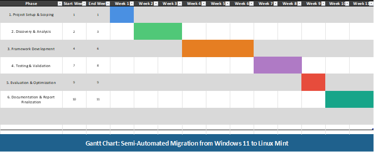

# Milestone M1 – Project Setup & Scoping

**Time Frame**: Week 1  
--------------

## 1. Overview

Milestone M1 establishes the foundational structure, scope, and objectives of the project **Semi-Automated Migration from Windows 11 to Linux Mint using a Python-Based Framework**.  
This stage ensures the project environment is configured, the documentation structure is created, and the research direction is formally defined.

---

## 2. Objectives of Milestone M1

- Define and finalize the project goals and research questions.  
- Initialize the GitHub repository and establish branch, label, issue, and milestone structures.  
- Set up the development environment for Python scripting and Linux Mint ISO usage/customization.  
- Create the documentation framework for technical, research, and progress reporting.  
- Establish tools, workflows, and conventions for implementation and academic reporting.

---

## 3. Project Objective

The goal of this project is to design, implement, and evaluate a **Python-based semi-automated migration framework** that facilitates the transition from Windows 11 to Linux Mint with minimal manual effort, while preserving data integrity and ensuring ease of use after system installation.

---

## 4. Action Objectives

### 4.1 Technical Objectives

- Develop a Python orchestration tool capable of automating the major migration stages (inventory, backup, installation preparation, restoration).  
- Design an integration strategy for using the automation framework from a Linux Mint Live USB environment, with guided prompts.  
- Evaluate system compatibility and automation reliability across virtual and physical environments.

### 4.2 Documentation & Research Objectives

- Produce a detailed migration guide and research report comparing the framework against the traditional manual migration procedure.  
- Document assumptions, limitations, and evaluation metrics to support academic reporting.

---

## 5. Research Questions

### RQ1 – Automation Feasibility  
How much of the Windows-to-Linux migration process can be reliably automated using Python without compromising system stability or user control?

### RQ2 – Data and Driver Integrity  
How can the framework ensure safe backup, restore, and hardware driver compatibility across heterogeneous systems?

### RQ3 – Usability and User Experience  
What level of user guidance and automation yields the most efficient and user-friendly migration experience for non-technical users?

### RQ4 – Validation and Performance  
What quantitative metrics can be used to measure automation efficiency, time saved, and post-installation success rates?

---

## 6. Project Plan

The project follows a phased research and implementation approach, combining software development with empirical validation.

### Phase 1 – Analysis and Preparation (Weeks 1–2)

- Define project goals and research questions.  
- Conduct hardware/software inventory using Python scripts (initial prototypes).  
- Map Windows applications to Linux alternatives at a conceptual level.  
- Define a data migration and restore strategy.

### Phase 2 – Framework Development (Weeks 3–6)

- Implement a modular Python CLI tool that automates migration steps (inventory, analysis, backup, restore stubs, validation stubs).  
- Integrate configuration and logging into the framework.  
- Prepare for later integration into a Linux Mint Live USB environment.

### Phase 3 – Testing and Validation (Weeks 7–8)

- Run tests in virtual and physical environments.  
- Measure automation coverage, manual time required, and system functionality after migration.  
- Refine error handling and validation logic based on test outcomes.

### Phase 4 – Evaluation and Documentation (Weeks 9–11)

- Compare results with the supervisor’s recommended manual migration process.  
- Evaluate usability, performance, and reliability of the framework.  
- Document the technical implementation, results, and usability insights in a formal report.  
- Prepare presentation and demo materials.

---

## 7. Tasks Completed in M1

- GitHub repository created and structured.  
- Milestones M1–M6 added and scoped.  
- Issues for each milestone generated and linked to the project board.  
- Labels and workflow established; GitHub project board configured.  
- Documentation folder structure prepared (`docs/technical`, `docs/research`, `docs/progress`, `docs/reports`).  
- Project goal and research questions defined and recorded in documentation.

---

## 8. Tools and Environment Setup

### 8.1 Installed Tools

- Python 3 environment  
- Git & GitHub CLI  
- VirtualBox for test environments  
- Linux Mint ISO downloaded  
- Initial Python dependency setup (virtual environment, base requirements)

### 8.2 Repository Structure (Initial)

```text
semi-auto-migration/
│
├── docs/
│   ├── progress/
│   ├── technical/
│   ├── research/
│   └── reports/
│
├── src/
├── configs/
└── README.md


## 9. Challenges Encountered

- Finalizing the documentation structure to support both technical and research outputs.

- Aligning research questions with the engineering roadmap and supervisor recommendations.

## 10. Project Phases and Timelines


| Phase                             | Description                                                     | Duration | Weeks        |
|----------------------------------|-----------------------------------------------------------------|----------|--------------|
| 1. Project Setup and Scoping     | Define objectives, finalize design, configure dev environment   | 1 week   | Week 1       |
| 2. Discovery and Analysis        | Inventory collection, app mapping, data migration planning      | 2 weeks  | Weeks 2–3    |
| 3. Framework Development         | Python CLI tool, USB integration, automation core implementation| 3 weeks  | Weeks 4–6    |
| 4. Testing and Validation        | VM and physical testing, metrics collection, error handling     | 2 weeks  | Weeks 7–8    |
| 5. Evaluation and Optimization   | Refine based on metrics, improve UX and documentation           | 1 week   | Week 9       |
| 6. Documentation and Finalization| Write report, prepare demo, finalize presentation               | 2 weeks  | Weeks 10–11  |


